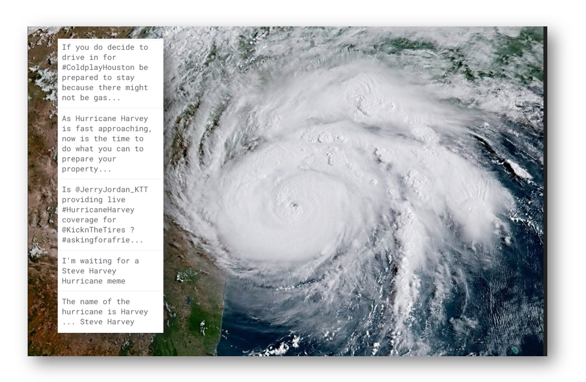
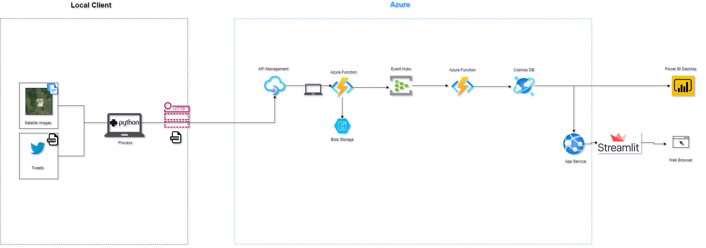

# ⚙️ Data Engineering Project ⚙️

# 🌪️🌪️ Hurricane Harvey  Tweets and Satelite Images - Azure Data Pipelines and Data Visualization 🌪️🌪️

# Introduction & Goals

**Main goals:**
>> Engineer streaming processing data pipeline on Azure with a main purpose to ingest and process tweets and satelite images data from Hurricane Harvey natural disaster, and serve Power BI report.

This is a meta repository that contains documentation and links to several GitHub repositories each of them having a distinct purpose:

  1) [hurricane-proc-send-data](https://github.com/baky0905/hurricane-proc-send-data). Pre-processing of tweets about the hurricane harvey events, combining it with satelite images of the building s with and without damage and simulating a streaming data source by building a python program that sends requests to a Azure API endpoint (#TODO fire CLI)
  
  2) Data Pipeline:
   
      2.1) [hurricane-streaming-az-funcs](https://github.com/baky0905/hurricane-streaming-az-funcs) Azure streaming data pipeline that:
        - Ingests tweets from the local source client via Azure API management having a Azure Function as a backend
        - Utilizes Azure Event Hub as a message queue service
        - Azure Function that takes messages from Azure Event Hub and writes them to Azure Cosmos Database

In addition, I have written four posts with some more details related to the data streaming pipeline, and published it on my personal website:
   - [Introduction](https://baky0905.github.io/personal-website/blog/2021/02/28/data-engineering-part1)
   - [Date Preprocessing](https://baky0905.github.io/personal-website/blog/2021/03/06/data-engineering-part2)
   - [Azure APIM, Azure Functions, Blob Storage](https://baky0905.github.io/personal-website/blog/2021/03/07/data-engineering-part3)
   - [Azure Event Hubs, Function and Cosmos DB](https://baky0905.github.io/personal-website/blog/2021/03/08/data-engineering-part4)

# Contents

- [⚙️ Data Engineering Project ⚙️](#️-data-engineering-project-️)
- [🌪️🌪️ Hurricane Harvey  Tweets and Satelite Images - Azure Data Pipelines and Data Visualization 🌪️🌪️](#️️-hurricane-harvey--tweets-and-satelite-images---azure-data-pipelines-and-data-visualization-️️)
- [Introduction & Goals](#introduction--goals)
- [Contents](#contents)
- [The Data Sets](#the-data-sets)
- [Used Tools](#used-tools)
  - [Connect](#connect)
  - [Buffer](#buffer)
  - [Processing](#processing)
  - [Storage](#storage)
  - [Visualization](#visualization)
- [Pipeline](#pipeline)
- [Author: 👤 **Kristijan Bakaric**](#author--kristijan-bakaric)
- [Follow Me On](#follow-me-on)
  - [Show your support](#show-your-support)
  - [Links used along the project](#links-used-along-the-project)

**Tools:**

- **Local:**
  - [WSL2 with Ubuntu 20.04](https://docs.microsoft.com/en-us/windows/wsl/install-win10)
    - as operating system for local development
  
  - [Visual Studio Code](https://code.visualstudio.com/) with plugins for Azure Services
    - local development and deployment do Azure (Azure Functions, Azure Web App)

  - Python and its libraries - Pandas, Requests 
    - data processing, and sending https requests to Azure API management
  
  - [Docker](https://www.docker.com/) 
    - for local development and as deployment solution of Python Streamlit Web App to Azure Web App
  
  - Azure SDK's 
    - for relevant Azure Services in Streamlit App use case - [azure-cosmos](https://pypi.org/project/azure-cosmos/)

  - Power BI 
    -  visualization of data from Azure Cosmos DB

- **Azure:**

  - [Azure API Management](https://docs.microsoft.com/en-us/azure/api-management/api-management-key-concepts)

  - [Azure Event Hubs](https://docs.microsoft.com/en-us/azure/event-hubs/event-hubs-about)

  - [Azure Function](https://docs.microsoft.com/en-us/azure/azure-functions/functions-overview)

  - [Azure Cosmos DB](https://docs.microsoft.com/en-us/azure/cosmos-db/introduction) - SQL Core - Document Store

  - [Azure App Service](https://docs.microsoft.com/en-us/azure/app-service/overview)

  - [Azure Blob Storage](https://docs.microsoft.com/en-us/azure/storage/blobs/storage-blobs-introduction) 

# The Data Sets

1) [Hurricane Harvey Tweets](https://www.kaggle.com/dan195/hurricaneharvey) from Kaggle.

Tweets containing Hurricane Harvey from the morning of 8/25/2017. I hope to keep this updated if computer problems do not persist.

*8/30 Update
This update includes the most recent tweets tagged "Tropical Storm Harvey", which spans from 8/20 to 8/30 as well as the properly merged version of dataset including Tweets from when Harvey before it was downgraded back to a tropical storm.

1) [Satellite Images of Hurricane Damage](https://www.kaggle.com/kmader/satellite-images-of-hurricane-damage) from Kaggle.

Overview
The data are satellite images from Texas after Hurricane Harvey divided into two groups (damage and no_damage). The goal is to make a model which can automatically identify if a given region is likely to contain flooding damage.

Source
Data originally taken from: https://ieee-dataport.org/open-access/detecting-damaged-buildings-post-hurricane-satellite-imagery-based-customized and can be cited with http://dx.doi.org/10.21227/sdad-1e56 and the original paper is here: https://arxiv.org/abs/1807.01688

# Used Tools
## Connect

- [Azure API Management](https://docs.microsoft.com/en-us/azure/api-management/api-management-key-concepts)
  >> API Management (APIM) is a way to create consistent and modern API gateways for existing back-end services.
  
## Buffer

- [Azure Event Hubs](https://docs.microsoft.com/en-us/azure/event-hubs/event-hubs-about)
  >> Azure Event Hubs is a big data streaming platform and event ingestion service. It can receive and process millions of events per second. Data sent to an event hub can be transformed and stored by using any real-time analytics provider or batching/storage adapters.

## Processing

- [Azure Function](https://docs.microsoft.com/en-us/azure/azure-functions/functions-overview)
  >> Azure Functions is a serverless solution that allows you to write less code, maintain less infrastructure, and save on costs. Instead of worrying about deploying and maintaining servers, the cloud infrastructure provides all the up-to-date resources needed to keep your applications running.

## Storage

- [Azure Blob Storage](https://docs.microsoft.com/en-us/azure/storage/blobs/storage-blobs-introduction) 
  >> Azure Blob storage is Microsoft's object storage solution for the cloud. Blob storage is optimized for storing massive amounts of unstructured data. Unstructured data is data that doesn't adhere to a particular data model or definition, such as text or binary data.

- [Azure Cosmos DB](https://docs.microsoft.com/en-us/azure/cosmos-db/introduction) - SQL Core - Document Store
  >> Azure Cosmos DB is a fully managed NoSQL database for modern app development. Single-digit millisecond response times, and automatic and instant scalability, guarantee speed at any scale. Business continuity is assured with SLA-backed availability and enterprise-grade security.

## Visualization

- [Power BI Desktop Report](https://powerbi.microsoft.com/en-us/desktop/)
  >> Rich, interactive reports with visual analytics.

# Pipeline

# Author: 👤 **Kristijan Bakaric**

# Follow Me On

* Website: [personal-website](https://baky0905.github.io/personal-website/)
* Twitter: [@kbakaric1](https://twitter.com/kbakaric1)
* Github: [@baky0905](https://github.com/baky0905)
* LinkedIn: [@kristijanb](https://linkedin.com/in/kristijanb)

## Show your support

Give a ⭐️ if this project helped you!

[Markdown Cheat Sheet](https://github.com/adam-p/markdown-here/wiki/Markdown-Cheatsheet)

## Links used along the project

